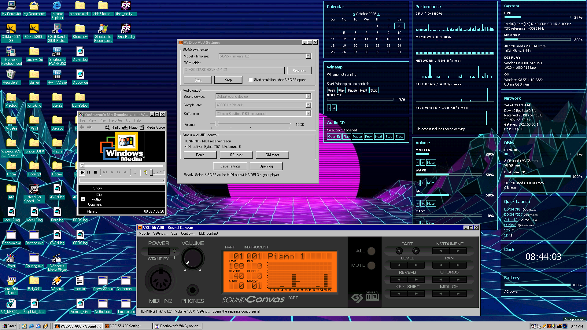
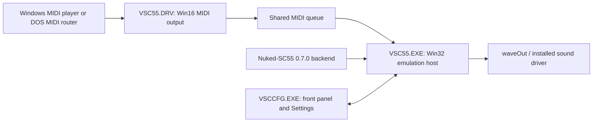

# VSC-55

A Roland SC-55 / SC-55mkII software MIDI sound module for **Windows 98 SE**.
VSC-55 combines the Nuked-SC55 emulator with a native Windows MIDI output
driver, sound-card playback, and a front-panel GUI.



The original emulator is **[Nuked-SC55 by nukeykt](https://github.com/nukeykt/Nuked-SC55)**.
VSC-55 uses [jcmoyer's backend fork](https://github.com/jcmoyer/Nuked-SC55).
The faceplate comes from [Nuked-SC55-GUI-Float](https://github.com/linoshkmalayil/Nuked-SC55-GUI-Float),
whose GUI lineage includes **kebufu / [mckuhei](https://github.com/mckuhei/Nuked-SC55)**
and GUI design credited to **Grieferus**. See [full credits and exact asset source](CREDITS.md).

## Features

- Appears as **VSC-55** in Windows MIDI output selection.
- Plays Windows MIDI applications and MIDI routed from DOS games running under Windows.
- Native SC-55 front panel with firmware-driven LCD and buttons, plus a separate Settings window.
- SC-55 firmware 1.00, 1.10, 1.20, 1.21 and 2.00; SC-55mkII 1.01 and CTF-patched 1.01.
- System-tray operation, startup in **STOPPED** mode by default, ROM selection, LCD contrast and 0-1600% output gain.
- Sound output through existing Windows waveOut drivers; defaults to 48 kHz, 20 ms x 8 buffers.

## Requirements

Windows 98 SE, a working Windows sound driver, and your own matching ROM dumps.
**ROMs are not supplied.** DOS games require an external MPU-401/MIDI routing
solution; VSC-55 does not intercept hardware ports and does not run in real-mode DOS.
For DOS games running under Windows, [VOPL3](https://github.com/sdz-mods/VOPL3)
can provide this routing. Select **VSC-55** as the MIDI output device in VOPL3.

The code is built for i686 without requiring SSE/SSE2. Emulation is CPU-intensive even without
MIDI input. Testing used an Intel i7-4940MX with HDA/WDM audio, including operation
at 2.4 GHz. You will need a fast CPU.

## Installation

Use a complete binary package. To build one from this source checkout, see
[BUILDING.md](BUILDING.md).

1. Extract the entire package and run `INSTALL.BAT` from its folder on Windows 98.
2. Copy your ROMs into `C:\VSC-55\ROMS` using the [folder layout below](#rom-folders).
3. Reboot. The panel starts in the tray, stopped.
4. Open the panel, select your firmware/ROM folder, and press Power/Start.
5. Select **VSC-55** in Windows Multimedia MIDI settings or your MIDI router/player.

The installer stops an existing panel before replacing files and preserves
settings and ROMs. A different registered driver must first be uninstalled
and unloaded by rebooting.

## ROM folders

Provide matching ROM dumps. The default paths beneath C:\VSC-55\ROMS are:

| Model | Folder |
| --- | --- |
| SC-55 1.00 | MK1\1.00 |
| SC-55 1.10 | MK1\1.10 |
| SC-55 1.20 | MK1\1.20 |
| SC-55 1.21 | MK1\1.21 |
| SC-55 2.00 | MK1\2.00 |
| SC-55mkII 1.01 | MK2\1.01 |
| SC-55mkII CTF 1.01 | MK2\CTF1.01 |

Select another folder in Settings if desired. The loader identifies ROMs by
content hashes; renaming files does not make an incorrect or incomplete set valid.
Other upstream models remain a core capability, but are not exposed/tested by
this seven-choice control panel.

## Panel and audio

Power/Start begins emulation; Stop ends it. Firmware and sound-device changes
require Stop. The LCD and module buttons are driven by the emulated firmware.
Use Settings for ROM folders, audio device, sample rate, buffers, gain and autostart. Save settings when
changing them. The front panel has size and LCD contrast menus.

The volume knob follows the pointer angle. Mouse wheel changes gain; double-click
returns to 100%. Gain runs from 0 to 1600%; 100% is unity. Boost can clip loud
passages; use only as much as necessary to balance MIDI with game sound effects.

Defaults are 48 kHz output and 20 ms x 8 buffers. Smaller queues reduce buffering
latency but can underrun. Emulation consumes CPU even when no notes play.

Select a sample rate in Settings while stopped, or edit `C:\VSC-55\VSC55.INI`:

```ini
[Audio]
SampleRate=48000
```

Accepted rates are **11025, 16000, 22050, 32000, 44100 and 48000 Hz**.
A missing or invalid value uses 48000. GUI changes apply on the next Start;
click Save settings to persist them without starting. For manual INI edits,
exit the GUI before editing and reopen it afterward. The command-line host reads
the same INI beside its executable. Output remains 16-bit stereo. The selected
sound driver must accept the rate; an unsupported device format fails startup
and is recorded in VSC55.LOG. The log also records the effective output rate.
Buffer durations are rounded to the nearest whole sample.

The core's current oversampled output is 64000 Hz for SC-55 and 66207 Hz for
SC-55mkII. These remain unchanged: only the final resampling/output rate changes.
Lower rates reduce output bandwidth and do not substantially reduce core
emulation work. 48000 remains the recommended default.

Closing/minimizing the front panel hides it. Closing Settings hides Settings.
Playback continues. Tray Exit stops the host and removes the tray icon.
Startup is stopped by default. To start emulation automatically on GUI launch
(including Windows startup), check **Start emulation when VSC-55 opens** in
Settings and click **Save settings**, or set `AutoStart=1` under `[Synth]` in VSC55.INI.
The default is `AutoStart=0`; missing/other values also leave it stopped.
Changing the checkbox does not immediately start or stop emulation; it applies
on the next GUI launch. Exit and reopen the GUI after manual INI edits.
Automatic start uses the saved ROM/audio
settings and makes one attempt; failures are not retried. Reopening the window
from the tray does not start emulation, and Stop remains effective.
Shutdown/reboot should require no application prompt.

## MIDI controls

- **Panic:** sends the host's all-sound/all-notes-off controls to clear stuck notes.
- **GS reset:** sends the Roland GS reset SysEx to initialize the emulated module's MIDI state.
- **GM reset:** sends General MIDI System On to initialize GM operation.

Resets can interrupt music and change instruments/controllers; their exact effects
are firmware-defined.

## Uninstall

Run C:\VSC-55\UNINSTALL.BAT, then reboot. MIDI registration and startup are
removed. Application files, settings and ROMs remain. After reboot you may delete
the application folder if no longer needed. Other MIDI registrations are preserved.

## Architecture



The driver copies messages into a locked shared queue and uses coalesced
asynchronous notifications. The Win32 host consumes it directly; no Win16
forwarding application is needed. The current endpoint supports one MIDI
client at a time. The MIDI registration helper is guarded to Windows 98.

VSC55.EXE runs the SC-55 emulator and sends its audio output to the sound driver.
Active realtime/time-critical scheduling protects it against DOS VM contention;
inactive priority is restored. The GUI has its own priority policy.

The unchanged upstream backend runs the original decoder. A sample FIFO preserves
all produced frames. Both models are resampled to the configured output rate
(48 kHz by default). MK1's measured +512 PCM16 DC
bias is subtracted before clipping; mkII is not given that correction. Gain is
applied in widened arithmetic. No compressor or quality-reducing emulation mode
is used. The front panel reads shared firmware LCD state.

Detailed timing diagnostics are normally compiled out. Build with
`tools/build-panel.ps1 -TimingDiagnostics` to enable them separately.

## Source provenance and credits

- Original emulator: [nukeykt/Nuked-SC55](https://github.com/nukeykt/Nuked-SC55),
  developed by nukeykt with the original project contributors.
- Core used here: [jcmoyer/Nuked-SC55](https://github.com/jcmoyer/Nuked-SC55) 0.7.0, commit
  02f6e3d7bad89af33514bd48211bb950f8ad0e6b, checked out as a pinned submodule.
  The backend is compiled unchanged with VSC-55's generated configuration.
- Faceplate: an unmodified copy of
  [GUI-Float's data/sc55_background.bmp](https://github.com/linoshkmalayil/Nuked-SC55-GUI-Float/blob/bf4b8319d120814dfbc3a467a578d8ea16a90d08/data/sc55_background.bmp)
  at commit `bf4b8319d120814dfbc3a467a578d8ea16a90d08`, stored as
  `assets/frontpanel-float/PANEL.BMP`. Hash and source path are recorded in
  `assets/frontpanel-float/PROVENANCE.json`. Separate original MAME license retained.
- Earlier GUI work: GUI-Float explicitly credits kebufu's
  [mckuhei/Nuked-SC55](https://github.com/mckuhei/Nuked-SC55), and credits Grieferus
  for GUI design. See [CREDITS.md](CREDITS.md) for the pinned acknowledgment.
- LCD contrast curve: adapted from GUI-Float; GPL source notice retained in lcdview.cpp.

No ROMs or Windows system binaries are included in this repository.

## Licensing

The emulator and VSC-55 integration use **GPL-2.0-or-later**, with MIT-licensed
utility files identified by their headers. The **separate faceplate artwork has
original MAME non-commercial terms**. The complete skin-equipped package is not
covered solely by GPL. Read [LICENSES.md](LICENSES.md) and the included notices.
No ROMs or rights to ROM firmware are included. This is an independent project,
not an official Roland product.
